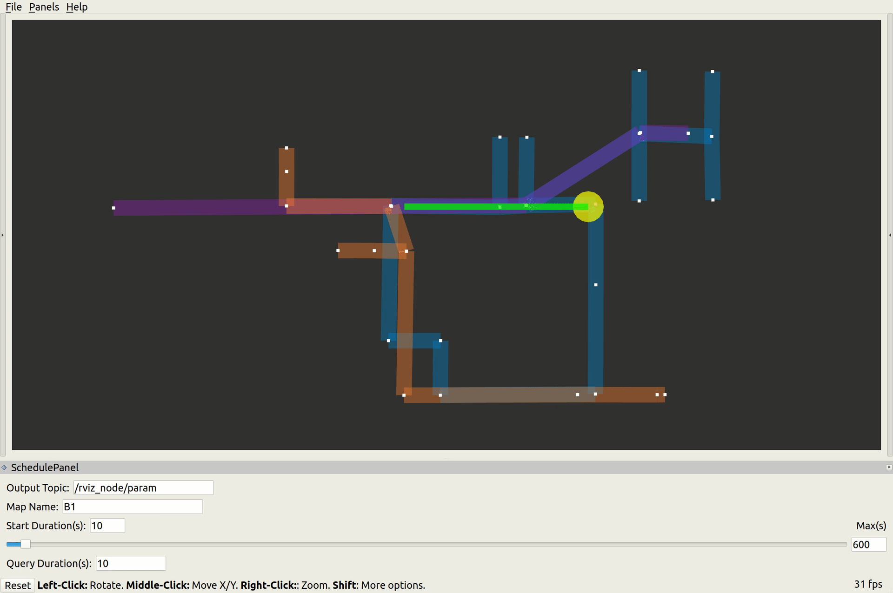

# Open-RMF Visualization


[](https://codecov.io/gh/open-rmf/rmf_visualization)


This repository contains several packages that aid with visualizing various entities within RMF via RViz.
* [rmf_visualization](#rmfvisualization)
* [rmf_visualization_building_systems](#rmfvisualizationbuildingsystems)
* [rmf_visualization_fleet_states](#rmfvisualizationfleetstates)
* [rmf_visualization_floorplans](#rmfvisualizationfloorplans)
* [rmf_visualization_navgraphs](#rmfvisualizationnavgraphs)
* [rmf_visualization_obstacles](#rmfvisualizationobstacles)
* [rmf_visualization_rviz2_plugins](#rmfvisualizationrviz2plugins)
* [rmf_visualization_schedule](#rmfvisualizationschedule)

## Installation
It is recommended to follow the instructions [here](https://github.com/open-rmf/rmf#rmf) to setup an RMF workspace with the packages in this repository along with other dependencies.


## rmf_visualization
A package that contains the main [launch file](rmf_visualization/launch/visualization.launch.xml) to bringup all the visualizers. Descriptions of various configurable parameters is provided within the launch file.

To launch the visualizer
```
ros2 launch rmf_visualization visualization.launch.xml
```

## rmf_visualization_building_systems
A visualizer for lifts and doors in the facility. The ROS 2 node subscribes to `DoorState` and `LiftState` ROS 2 messages published over `/door_states` and `/lift_states` topics. It then publishes RViz markers depicting the location and status of these systems over `/building_systems_markers` with `Transient Local` durability.

## rmf_visualization_fleet_states
A visualizer for the current positions of various robot as reported by their fleet managers. The ROS 2 node subscribes to `FleetState` ROS 2 messages published over `/fleet_states`. It then publishes RViz markers depicting the location of the robots over `/fleet_markers`.

## rmf_visualization_floorplans
A visualizer for the floorplan images for each building level. The ROS 2 node subscribes to `BuildingMap` ROS 2 messages published over `/map`. It then converts the image to an `OccupancyGrid` and publishes it over `/floorplan`.

## rmf_visualization_navgraphs
https://user-images.githubusercontent.com/13482049/176585472-115ef57b-7792-4f02-93d3-c50a3ad70c95.mp4

A visualizer for the navigation graphs used by each fleet of robots. Lanes that are closed are shared grey while speed limited ones have relatively narrower widths. The ROS 2 node subscribes to `Graph` ROS 2 messages published over `/nav_graphs`. It then publishes RViz markers depicting color coded lanes for each fleet over `/map_markers` with `Transient Local` durability.

## rmf_visualization_obstacles


A visualizer for obstacles detected. The ROS 2 node subscribes to `Obstacles` ROS 2 messages published over `/rmf_obstacles`. It then publishes RViz markers depicting the obstacles over `/fleet_markers` with `Transient Local` durability.

## rmf_visualization_rviz2_plugins

This package provides several RViz panels to update the view and submit requests to Open-RMF.

### RMFSchedulePanel
For a given `map_name`, the `rmf_visualization_schedule_data_node` queries for trajectories in the RMF schedule database over a duration that is specified by `start_duration` and `query_duration` parameters.
The expected location and vicinity of a participant are visualized with concentric yellow and blue circles respectively.
The expected trajectory for a participant is a green polyline when conflict-free and is red otherwise.
The `SchedulePanel` in RViz allows users to modify the parameters used to query trajectories in the schedule database.
### Door and Lift panels
`Door` and `Lift` panels allow users to interact with these systems respectively.
The `rmf.rviz` file is used to save the configuration of RViz along with default values of parameters used in the different panels.

## rmf_visualization_schedule


A visualizer of the predicted schedule of robots as submitted by fleet adapters to the RMF Schedule Database. The ROS 2 node spawns a `Mirror` of the RMF Schedule Database which is queries before publishing markers depicting the trajectory of robots as green line strips to `/schedule_markers`. The `footprint` and `vicinity` of each robot is represented by yellow and cyan cylindrical markers respectively.

An active `rmf_traffic_schedule` node is prerequisite for the visualizer to initialize. If a schedule node is not running, it can be started with the command
```
ros2 run rmf_traffic_ros2 rmf_traffic_schedule
```
>Note: Only one instance of `rmf_traffic_schedule` must be active at any moment.


## Websocket Server for Custom UIs
For developers looking to create custom UIs outside of the ROS2 environment, this repository provides a websocket server to exchange information contained in an active rmf schedule database. This may primarily be used to query for robot trajectories in the schedule along with conflict information if any. The format for various requests and corresponding responses are described below.

The websocket server starts up when `visualization.launch.xml` is launched.

### Sample Client Requests

#### Server Time
To receive the current server time in milliseconds
```
{"request":"time","param":{}}

```
Sample server response
```
{"response":"time","values":[167165000000]}
```

#### Trajectories in RMF Schedule
To receive a list of active trajectories and conflicts if any between `now` and until a `duration`(milliseconds)
```
{"request":"trajectory","param":{"map_name":"L1","duration":60000, "trim":true}}
```

If `trim` is `false`, data of the complete trajectory is forwarded even if there is only partial overlap in the query duration.

Sample server response
```
{
  "response":"trajectory",
  "values":[{
    "robot_name":"tinyRobot_1",
    "fleet_name:"tinyRobot",
    "shape":"circle",
    "dimensions":0.3,
    "id":310,
    "segments":[
      {"t":336857,"v":[0.018886815933120995,0.4996431607843137,0.0],"x":[11.610485884950174,-8.054053944114406,-1.6085801124572754]},
      {"t":338700,"v":[0.01888681593558913,0.4996431608496359,0.0],"x":[11.645306833719362,-7.132879672805034,-1.6085801124572754]}]}],
  "conflicts":[]
}

```
Here `segments` is a list of dictionaries containing parameters of the knots in the piecewise cubic spline trajectory. `x` stores positional data in [x, y,theta] coordinates while `v`, the velocity data in the same coordinates. `t` is the time recorded in milliseconds.
